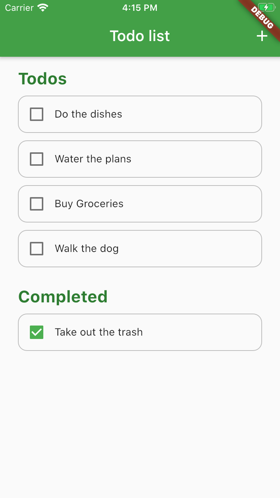

# Flutter Todo app

## Setup

Follow [this guide](https://flutter.dev/docs/get-started/install) 

- Install Flutter
- Do one of the following:
  - Install Xcode to build an iOS app
  - Install Android Studio and the Android SDK to build an Android app
- Set up an editor
- Run the starter app

